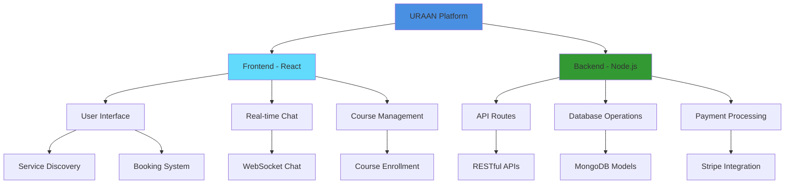

<div align="center">

#  URAAN

### 🚀 Local Freelance Marketplace & Skill-Sharing Platform


[](https://reactjs.org/)
[](https://nodejs.org/)
[](https://www.mongodb.com/)
[](https://tailwindcss.com/)

[]()
[]()

</div>

## 🌟 Featured In

<div align="center">

[]()
[]()

</div>

## 🎯 Key Features

<div align="center">

| Feature | Description | Status |
|:--------|:------------|:-------|
| 🔍 **Service Discovery** | Browse local professionals by category & location | ✅ Live |
| 💬 **Real-time Chat** | Instant messaging with service providers | ✅ Live |
| 📚 **Course Marketplace** | Enroll in skill-based training courses | ✅ Live |
| 🛒 **Booking System** | Secure service booking & payment processing | ✅ Live |
| 📊 **Freelancer Dashboard** | Manage services, courses & earnings | ✅ Live |
| 👑 **Admin Panel** | Comprehensive moderation & analytics | ✅ Live |

</div>

## 🛠️ Tech Stack Deep Dive

<div align="center">

### Frontend Excellence


### Backend Power


### Payment & Utilities


</div>

## 📊 Performance Metrics

<div align="center">


</div>

## 🏗️ Project Architecture



## 📁 Project Structure

```bash
URAAN/
├── frontend/                 # React + Vite Frontend
│   ├── public/              # Static assets
│   │   └── uraan.png        # Project logo
│   ├── src/                 # Source code
│   │   ├── components/      # Reusable components
│   │   ├── pages/           # Page components
│   │   ├── utils/           # Utility functions
│   │   └── assets/          # Images & icons
│   └── package.json         # Frontend dependencies
├── api/                     # Node.js + Express Backend
│   ├── controllers/         # Business logic
│   ├── models/             # MongoDB schemas
│   ├── routes/             # API endpoints
│   ├── middleware/         # Authentication & validation
│   ├── utils/              # Helper functions
│   └── package.json        # Backend dependencies
├── server.js               # Main server file
└── README.md              # Project documentation
```

## 🚀 Quick Start

### Prerequisites
- Node.js 20+
- MongoDB 7+
- npm or yarn

### Installation

1. **Clone the repository**
   ```bash
   git clone https://github.com/axadishaq/uraan.git
   cd uraan
   ```

2. **Install backend dependencies**
   ```bash
   cd api
   npm install
   ```

3. **Install frontend dependencies**
   ```bash
   cd ../frontend
   npm install
   ```

4. **Environment Setup**
   Create `.env` files in both `api/` and `frontend/` directories with required variables.

5. **Start Development**
   ```bash
   # Terminal 1 - Start backend
   cd api && npm run start
   
   # Terminal 2 - Start frontend
   cd frontend && npm run dev
   ```

## 🤝 Community & Support

<div align="center">

[](https://discord.gg/your-invite)
[](https://twitter.com/your-handle)
[](https://linkedin.com/company/your-company)

</div>

## 📄 License

This project is licensed under the **MIT License** - see the [LICENSE](LICENSE) file for details.

## 🙌 Acknowledgments

- **React Team** for the incredible frontend framework
- **Node.js Community** for robust backend solutions
- **MongoDB** for flexible database management
- **TailwindCSS** for beautiful utility-first styling
- **Stripe** for seamless payment integration

---

<div align="center">

### ⭐ **Support URAAN's Mission to Empower Local Talent!**

[](https://github.com/axadishaq/uraan/stargazers)
[](https://github.com/axadishaq/uraan/fork)

**Built with ❤️ for Local Communities Worldwide**

</div>
